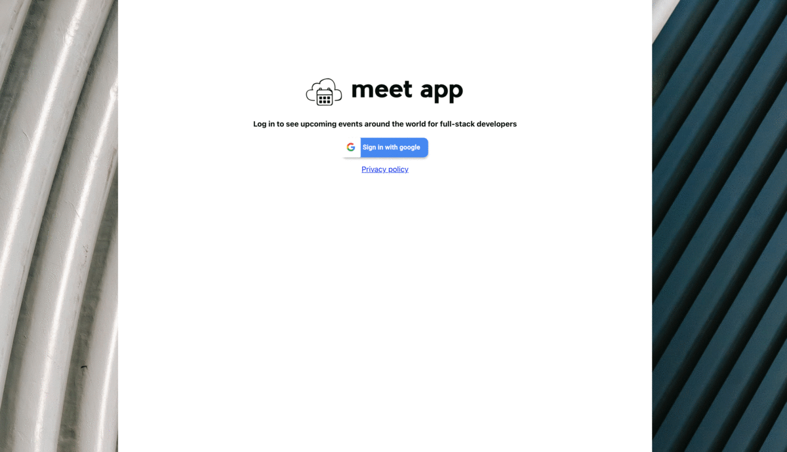

<h1>Meet App</h1>

A serverless PWA using Create React App that can display and filter meetup events from the Google calender API. It is developed using Test-Drive-Development techniques to ensure a high test coverage rate.

<h3>Featured 1: FILTER EVENTS BY CITY</h3>

As a user, I would like to be able to filter events by city so that I can see the list of events that take place in that city.

SCENARIO 1: WHEN USER HASN’T SEARCHED FOR A CITY, SHOW UPCOMING EVENTS FROM ALL CITIES.
Given user hasn’t searched for any city
When the user opens the app
Then the user should see a list of all upcoming events

SCENARIO 2: USER SHOULD SEE A LIST OF SUGGESTIONS WHEN THEY SEARCH FOR A CITY.
Given the main page is open
When user starts typing in the city textbox
Then the user should see a list of cities (suggestions) that match what they’ve typed

SCENARIO 3: USER CAN SELECT A CITY FROM THE SUGGESTED LIST.
Given the user was typing “Berlin” in the city textbox And the list of suggested cities is showing
When the user selects a city (e.g., “Berlin, Germany”) from the list
Then their city should be changed to that city (i.e., “Berlin, Germany”) And the user should receive a list of upcoming events in that city

<h3>FEATURE 2: SHOW/HIDE AN EVENT'S DETAILS</h3>

As a user, I would like to be able to show/hide event details so that I can see more/less information about an event.

Scenario 1: An event element is collapsed by default
Given The user is on main page
When a user select and event
Then an element collapsed by default

Scenario 2: User can expand an event to see its details
Given user is seeing the events
When a user choose and event and click on it
Then an element expand with details

Scenario 3: User can collapse an event to hide its details 
Given user user is seeing the events
When a user click on the event details
Then the element details hide

<h3>FEATURE 3: SPECIFY NUMBER OF EVENTS</h3>

As a user, I would like to be able to specify the number of events I want to view in the app so that I can see more or fewer events in the events list at once.

Scenario 1: When user hasn’t specified a number, 32 is the default number
Given user open the app
When user look for an event
Then 32 events max will be shown

Scenario 2: User can change the number of events they want to see
Given user open the app
When a user click on the event details
Then the element details hide

<h3>FEATURE 4: USE THE APP WHEN OFFLINE</h3>

As a user, I would like to be able to use the app when offline so that I can see the events I viewed the last time I was online.

SCENARIO 1: user app when offline.
Given the user has no internet connection.
When  user wants to use the app
Then the user should see cached data.

Scenario2: Show error when user changes the settings (city, time range).
Give the user has no internet connection.
When user goes to settings and try to changes city and/or time range
Then show error an error message.

<h3>FEATURE 5: DATA VISUALIZATION</h3>

As a user, I would like to be able to see a chart showing the upcoming events in each city so that I know what events are organized in which city.

Scenario 1: Show a chart with the number of upcoming events in each city
Give user looking for events in general
When user clicks on a map
Then show a chart with the number of upcoming events in each city

